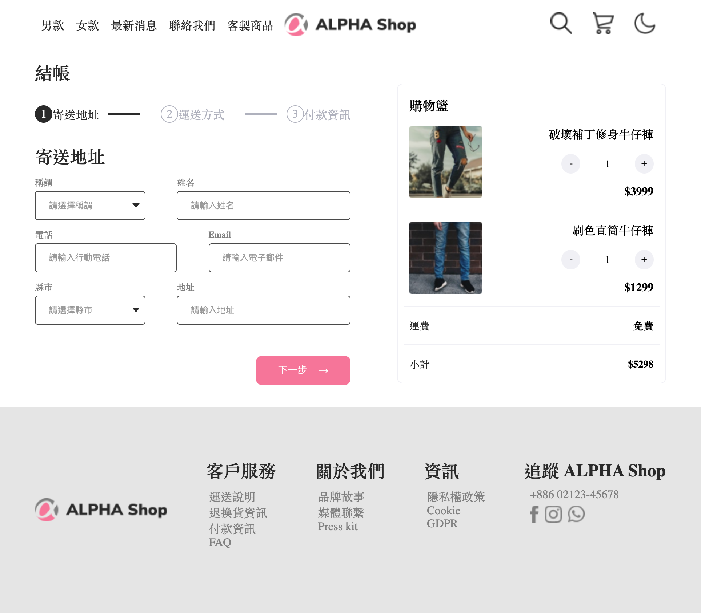

# ALPHA Shop 購物車 Vue.js

透過 Vue.js 打造的購物車網頁

## Features

- 「結帳區」一共有三個階段：寄送地址、運送方式和付款資訊
- 使用者在結帳區選擇 DHL 貨運時，運費能夠被反應到購物車中
- 使用者在購物車能夠調整商品數量，且價格能被反應小計中

## Preview



## Project setup

```
npm install
```

### Compiles and hot-reloads for development

```
npm run serve
```

### Compiles and minifies for production

```
npm run build
```

### Lints and fixes files

```
npm run lint
```

### Customize configuration

See [Configuration Reference](https://cli.vuejs.org/config/).
